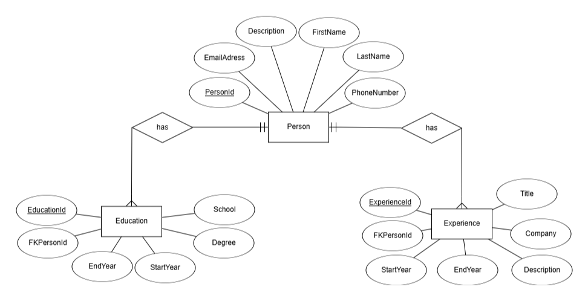

# 📄 CV Handler REST API

## 📋 About the Project
This is a school project from Chas Academy's Fullstack .NET Developer program. The project is a REST API built with ASP.NET Core Minimal API that manages CV information including personal details, education history, and work experience.

## ✨ Core Features
- **Manage Personal Information**: Create, view, update, and delete personal details
- **Track Education History**: Record and manage education achievements
- **Document Work Experience**: Store professional experience information

Each person record includes:
- 👤 First and last name
- 📧 Email address
- 📱 Phone number
- 📝 Personal description

## 🛠️ Technologies
- ASP.NET Core Minimal API
- Entity Framework Core
- SQL Server LocalDB

## 🔄 API Structure
The API consists of three main components:

### 👤 Person
- Get all persons
- Get person by ID
- Get person with detailed education and experience
- Create new person
- Update person
- Delete person

### 🎓 Education
- Get all education records
- Get education by ID
- Get education records for specific person
- Create new education record
- Update education record
- Delete education record

### 💼 Experience
- Get all experience records
- Get experience by ID
- Get experience records for specific person
- Create new experience record
- Update experience record
- Delete experience record

## 📂 Project Structure
- **Models**: Data models for Person, Education, and Experience
- **DTOs**: Data Transfer Objects for safe data transfer
- **Endpoints**: Minimal API endpoint definitions for each entity
- **Data**: DbContext for database connectivity with seeded test data

## 👨‍💻 Developed By
- Johannes Brannelid
- Student at Chas Academy
- Fullstack .NET Developer program 2024

## 📅 Course Information
- **Course**: Backend Development & API
- **School**: Chas Academy